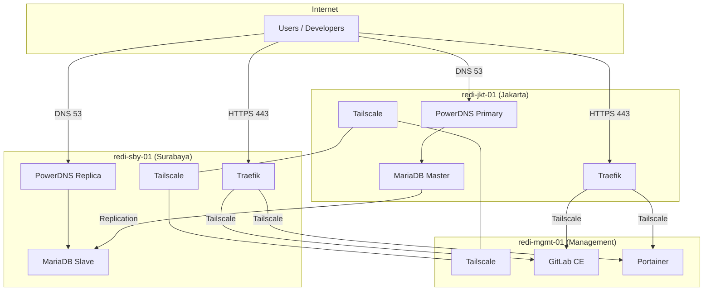

# REDI LAB — Architecture

## System Overview

REDI LAB Phase 1 establishes a three-node infrastructure platform designed for 10-year operational lifespan. The architecture separates edge traffic handling from centralized management.

## Design Principles

### Security First
- Default-deny firewall (UFW) on all nodes
- Fail2Ban for SSH protection
- Docker `no-new-privileges` on all containers
- Internal APIs bound to Tailscale interfaces
- TLS everywhere via Traefik + Let's Encrypt

### Network Isolation

| Docker Network | Subnet | Purpose |
|----------------|--------|---------|
| `redi-dns` | 172.28.0.0/24 | PowerDNS + MariaDB |
| `redi-proxy` | 172.29.0.0/24 | Traefik routing |
| `redi-management` | 172.30.0.0/24 | GitLab, Portainer |

### Private Mesh
All inter-node communication uses **Tailscale** (100.64.0.0/10). No service depends on public IP addresses for internal operations.

## Server Roles

### redi-jkt-01 — Primary Edge (Jakarta)
- **Public IP:** 103.149.238.98
- **Services:** PowerDNS (primary), MariaDB (master), Traefik
- **DNS:** Authoritative primary for `redi.lab` zone

### redi-sby-01 — Secondary Edge (Surabaya)
- **Public IP:** 103.80.214.144
- **Services:** PowerDNS (replica), MariaDB (slave), Traefik
- **DNS:** Authoritative replica, MariaDB async replication

### redi-mgmt-01 — Management Plane
- **Hosted on:** Proxmox (103.80.214.144:2280)
- **Services:** GitLab CE, Portainer
- **Phase 2:** Authentik, Prometheus, Grafana, Loki, Uptime Kuma

## Data Flow

### HTTPS Request
1. Client resolves `gitlab.redi.lab` via PowerDNS
2. Request hits Traefik on edge node (jkt or sby)
3. Traefik terminates TLS (Let's Encrypt DNS-01 via PowerDNS API)
4. Request proxied over Tailscale to GitLab on mgmt node

### DNS Query
1. Client queries port 53 on edge node
2. PowerDNS authoritative responds from MariaDB backend
3. Replica node serves identical records via replication

## High Availability Considerations

| Component | HA Strategy | Phase |
|-----------|-------------|-------|
| DNS | Dual authoritative nodes | Phase 1 |
| MariaDB | Async replication | Phase 1 |
| Traefik | Dual edge nodes (DNS round-robin) | Phase 1 |
| GitLab | Single node + backup/restore | Phase 1 |
| MariaDB failover | Manual promotion | Phase 2 |

## Disaster Recovery

- Automated daily backups via `scripts/backup/backup-all.sh`
- MariaDB replication provides near-real-time copy on sby node
- GitLab backup includes database, repositories, and secrets
- Traefik ACME certificates backed up separately
- See [restore.md](restore.md) for recovery procedures

## Phase 2 Roadmap

- Authentik SSO for all services
- Prometheus + Grafana monitoring stack
- Loki centralized logging
- Uptime Kuma external monitoring
- Automated MariaDB failover
- GitLab HA or secondary standby
