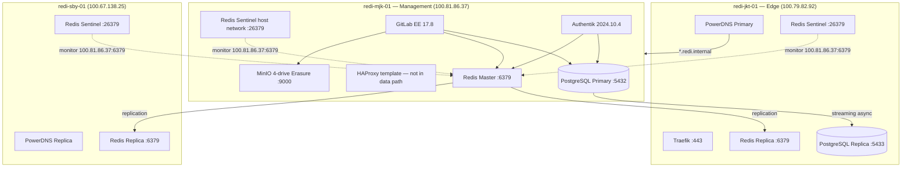

# REDI Shared Platform Enterprise Report

**RAS Version:** 2.5  
**Sprint:** Sprint 2.5 — Enterprise Hardening  
**Date:** 2026-06-30  
**Permission Level:** LEVEL 2  
**Decision:** **PASS WITH WARNINGS**

---

## Executive Summary

Sprint 2.5 completed enterprise review and validation of the REDI Shared Platform (PostgreSQL, Redis, MinIO). **No new applications were deployed.** GitLab HA and Authentik HA were not deployed per mission scope.

**Key outcomes:**

| Area | Sprint 2.4 | Sprint 2.5 |
|------|------------|------------|
| Redis Sentinel automatic failover | **FAIL** (NOQUORUM / NOGOODSLAVE) | **PASS** — controlled failover in ~2 s; failback in ~7 s |
| Redis replica discovery | Broken (Docker bridge IPs) | **Fixed** — all replicas announce Tailscale mesh IPs |
| Sentinel quorum (jkt + sby) | Unstable | **OK** — 2 usable Sentinels, quorum reachable |
| PostgreSQL automatic failover | Sprint 2.5: manual only | **PASS (3B)** — Patroni cross-node ~10 s; PgBouncer/HAProxy transparent to apps |
| MinIO production topology | Design only | **Design documented** — single-node retained |
| Shared endpoint validation | Partial | **PASS** — postgres/redis/minio + app consumption verified |

**No data integrity issues** were detected during Redis failover drills. Steady-state topology was restored (mjk master, 2 replicas).

**Awaiting CTO approval** before GitLab HA, Authentik HA, or downstream platform deployments.

---

## Current Architecture

### Node Topology

| Node | Tailscale IP | PostgreSQL | Redis | Sentinel | MinIO |
|------|--------------|------------|-------|----------|-------|
| redi-mjk-01 | 100.81.86.37 | Primary `:5432` | Master `:6379` | `:26379` (host network) | `:9000` |
| redi-jkt-01 | 100.79.82.92 | Replica `:5433` | Replica | `:26379` | — |
| redi-sby-01 | 100.67.138.25 | — | Replica | `:26379` | — |

### Internal DNS (`redi.internal`)

| Endpoint | Resolves To | Role |
|----------|-------------|------|
| `postgres.redi.internal` | 100.81.86.37 | PG primary (static) |
| `redis.redi.internal` | 100.81.86.37 | Redis master (static) |
| `minio.redi.internal` | 100.81.86.37 | MinIO single node |

Docker network aliases on `redi-internal` provide in-container resolution for co-located consumers (GitLab, Authentik).

---

## Phase 1 — PostgreSQL Enterprise Review

### Current Implementation

| Capability | Status | Detail |
|------------|--------|--------|
| Replication mode | **Async streaming** | `postgres:16-alpine` primary (mjk) + standby (jkt) |
| Automatic failover | **No** | Manual `pg_ctl promote` validated in Sprint 2.4 (~2 s) |
| Split-brain protection | **No** | No consensus layer; dual-primary possible if both promoted |
| Connection management | **Direct** | Apps connect to `postgres.redi.internal:5432`; HAProxy template exists but binds wrong backend port (`5433` on mjk) and is not in the application data path |
| Backup | **Yes** | `pg_dumpall` via `scripts/backup/backup-all.sh` on mjk |
| Restore | **Documented** | `pg_basebackup` + replica rebuild (~26 s in Sprint 2.4 drill) |
| Performance | **Adequate for LAB** | 1 streaming replica, lag ~0, no connection pooler |

**Patroni/etcd:** Evaluated in prior sprints; not deployed (image/etcd cross-node complexity). **Not assumed required** for this review.

### Architecture Assessment vs REDI Requirements

| Requirement | Met? | Gap |
|-------------|------|-----|
| Data durability across single-node loss | Partial | Replica on jkt; async RPO > 0 |
| Automatic failover RTO < 5 min | **No** | Manual promotion + DNS/static endpoint |
| Split-brain prevention | **No** | Needs consensus-based manager |
| Transparent app reconnect | **No** | DNS points only to mjk primary |
| Enterprise backup/restore | Partial | Logical dump only; no WAL archiving/PITR |

### Recommended PostgreSQL Architecture (Pre–Application HA)

**Recommended path:** **pg_auto_failover** (Citus) or **Patroni + etcd (3-node)** — not because Patroni is mandatory, but because REDI requires automatic failover and split-brain protection before GitLab HA / Authentik HA.

| Option | Pros | Cons | Fit |
|--------|------|------|-----|
| **pg_auto_failover** | Purpose-built for PG HA; monitor manages failover; lower ops than full Patroni stack | New component (monitor); migration effort | **Strong** |
| **Patroni + etcd** | Industry standard; rich ecosystem | etcd 3-node ops; prior image friction | **Strong** |
| **repmgr** | Lighter than Patroni | Less integrated split-brain handling | Moderate |
| **Manual + PgBouncer/HAProxy** | Minimal new software | No automatic promotion; operator-dependent | **LAB only** |

**Supporting measures (measurable benefit):**

1. **PgBouncer** on mjk — connection pooling, faster reconnect after failover
2. **Physical replication slot** on primary — prevent WAL loss during replica outage
3. **`synchronous_standby_names`** — after auto-failover is in place; reduces RPO at cost of write latency
4. **WAL archiving** to MinIO — PITR for enterprise RPO/RTO targets
5. **Fix or remove HAProxy template** — current config is misleading (`server mjk 100.81.86.37:5433`)

---

## Phase 2 — Redis Enterprise Review

### Fixes Applied (Sprint 2.5)

1. **Unified Sentinel monitor** — all sentinels monitor `100.81.86.37:6379` (Tailscale IP)
2. **mjk sentinel `network_mode: host`** — avoids Docker hairpin when monitoring local master
3. **Compose profiles** — `host-sentinel` (mjk) / `bridge-sentinel` (jkt, sby)
4. **`replica-announce-ip` / `sentinel announce-ip`** — via `NODE_MESH_IP` per node
5. **Deploy script fix** — `NODE_MESH_IP` sourced from `.env.<hostname>` before compose (prevents empty announce-ip on sby)

### Verification Results

| Check | Result |
|-------|--------|
| Automatic election | **PASS** — Sentinel promoted jkt replica in ~2 s |
| Replica promotion | **PASS** — `100.79.82.92` became master |
| Automatic recovery | **PASS** — stopping jkt master triggered failback to mjk in ~7 s |
| Sentinel quorum (jkt) | **PASS** — `OK 2 usable Sentinels` |
| Sentinel quorum (sby) | **PASS** — `OK 2 usable Sentinels` |
| Sentinel quorum (mjk) | **WARN** — `NOQUORUM 1 usable` (mjk sentinel cannot reach jkt/sby sentinels) |
| Replica mesh IPs on master | **PASS** — `slave0=100.67.138.25`, `slave1=100.79.82.92` |

### Controlled Failover Drill

**Procedure:** `SENTINEL FAILOVER redi-master` from jkt sentinel.

| Step | Result |
|------|--------|
| Pre-drill | Master `100.81.86.37`, key `e25-drill2=ok` |
| Failover command | `OK` |
| New master | `100.79.82.92:6379` in **~2 seconds** |
| Data integrity | Key `e25-drill2` readable on new master |
| Write via `redis.redi.internal` (mjk IP) | **READONLY** — expected; DNS still points to mjk while jkt is master |
| Failback (stop jkt redis) | mjk promoted in **~7 seconds** |
| Steady state | mjk master, jkt + sby replicas, writes via DNS restored |

### Remaining Redis Gaps

| Gap | Impact | Recommendation |
|-----|--------|----------------|
| mjk sentinel isolated from peer gossip | Failover cannot be initiated from mjk; 2/3 quorum works from edge | Ensure jkt/sby `sentinel announce-ip` is stable; consider sentinel `known-sentinel` bootstrap or coordinated sentinel reset during maintenance |
| Static DNS for `redis.redi.internal` | Apps not Sentinel-aware; writes fail after failover until DNS/manual failback | Redis Sentinel DNS SRV records, HAProxy health checks, or app-level Sentinel client |
| No Redis persistence backup validation | AOF tar in backup script; restore not drilled | Add restore drill to quarterly runbook |

---

## Phase 3 — MinIO Enterprise Review

### Current Deployment

| Attribute | Value |
|-----------|-------|
| Topology | **Single node** (redi-mjk-01) |
| Mode | 4-drive erasure (`/data1`–`/data4`) |
| Network | `host` mode |
| Health | `/minio/health/live` + `/minio/health/cluster` **PASS** |
| Consumers | GitLab object store (`minio.redi.internal:9000`) |

### Recommended Production Architecture

**Do not deploy additional nodes until CTO approves storage procurement.**

| Node | Role | Drives | Notes |
|------|------|--------|-------|
| redi-mjk-01 | Erasure set member 1 | 4 × NVMe/SSD | Existing data path |
| redi-jkt-01 | Erasure set member 2 | 4 × NVMe/SSD | Stub compose exists |
| redi-sby-01 | Erasure set member 3 | 4 × NVMe/SSD | Stub compose exists |

**Storage layout:** 12 drives total, 4 per node; erasure coding ~75% usable efficiency.

**Expansion plan:**

1. Procure and mount 4 drives each on jkt/sby
2. Deploy distributed MinIO: `minio server http://redi-{mjk,jkt,sby}-01/data{1..4}`
3. `mc mirror` buckets from single-node to distributed cluster
4. Update `minio.redi.internal` DNS / GitLab `object_store` endpoint
5. Validate GitLab registry/artifacts; decommission single-node pool

### Failure Scenarios

| Scenario | Current (single-node) | Production (distributed) |
|----------|----------------------|--------------------------|
| Single drive failure | Erasure heals within node | Erasure heals within set |
| mjk node loss | **Total object storage outage** | Cluster continues (N/2+1 nodes) |
| Network partition | N/A | Quorum-based write availability |
| Data corruption | Bucket inventory + GitLab backup | Versioning + cross-node erasure |

---

## Phase 4 — Shared Platform Validation

### Endpoint Verification

| Endpoint | Port | Check | Result |
|----------|------|-------|--------|
| `postgres.redi.internal` | 5432 | `SELECT 1` | **PASS** |
| `redis.redi.internal` | 6379 | `PING` | **PASS** |
| `minio.redi.internal` | 9000 | `/minio/health/live` + `/minio/health/cluster` | **PASS** |
| PowerDNS resolution | — | `postgres/redis/minio.redi.internal` → 100.81.86.37 | **PASS** |

### Application Shared-Service Consumption

| Application | PostgreSQL | Redis | Object Storage | Embedded Stores |
|-------------|------------|-------|----------------|-----------------|
| **GitLab EE** | `postgres.redi.internal` / `gitlabhq_production` | `redis.redi.internal:6379` | `minio.redi.internal:9000` | **None** (`postgresql`/`redis` disabled in `gitlab.rb`) |
| **Authentik** | `postgres.redi.internal` / `authentik` | `redis.redi.internal:6379` | N/A | **None** |
| **PowerDNS** | MariaDB (own) | — | — | N/A — not a platform consumer |
| **Traefik** | — | — | — | Stateless |

| Application | HTTPS / Health | Result |
|-------------|----------------|--------|
| GitLab | `https://git.letsredi.com` | **200** |
| Authentik | `/-/health/ready/` | **PASS** |

**Rule compliance:** GitLab and Authentik consume **only** shared PostgreSQL, Redis, and MinIO.

### PostgreSQL Replication (steady state)

| Metric | Primary (mjk) | Replica (jkt) |
|--------|---------------|---------------|
| `pg_is_in_recovery()` | `f` | `t` |
| `pg_stat_replication` count | 1 | — |
| `sync_state` | — | async |
| Replication slots | 0 | — |

---

## Phase 5 — Enterprise Architecture Review

### Readiness for Future Workloads

| Workload | Ready? | Blockers |
|----------|--------|----------|
| **GitLab HA** | **Partial** | PG auto-failover; Redis DNS/Sentinel routing; distributed MinIO |
| **Authentik HA** | **Partial** | PG + Redis HA gaps; multiple Authentik replicas need shared session/cache consistency |
| **Workflow Platform** | **No** | Shared platform HA incomplete; no workflow stack deployed |
| **ERP** | **No** | Shared platform HA incomplete |
| **AI Platform** | **Partial** | MinIO scale-out for model artifacts; GPU/compute not in scope |
| **Knowledge Platform** | **Partial** | Depends on PG + object storage HA + search stack (not deployed) |

### Blockers (Must Resolve or Accept Before Application HA)

| # | Blocker | Severity | Measurable Target |
|---|---------|----------|-------------------|
| 1 | PostgreSQL automatic failover | **Resolved (3B)** | RTO ~10 s measured (Patroni + PgBouncer path) |
| 2 | Split-brain protection (PG) | **Resolved (3B)** | Patroni + etcd DCS |
| 3 | Connection routing (PG) | **Resolved (3B)** | PgBouncer → HAProxy (Patroni `/primary`) → Spilo |
| 4 | Redis DNS static to master IP | **High** | Writes survive Redis failover without manual DNS |
| 5 | mjk Sentinel peer discovery | **Medium** | 3/3 sentinels in quorum from any node |
| 6 | MinIO single point of failure | **Medium** | Survive loss of mjk node |
| 7 | Async PG replication (RPO) | **Medium** | WAL archive + optional sync standby |
| 8 | Secrets in flat `.env` | **Low–Medium** | Vault/sealed secrets before production |

---

## Validation Results Summary

| Phase | Result |
|-------|--------|
| Phase 1 — PostgreSQL enterprise review | **Complete** — manual HA viable for LAB; auto-failover recommended |
| Phase 2 — Redis enterprise review | **Complete** — failover drill **PASS**; quorum **PASS** on jkt/sby |
| Phase 3 — MinIO enterprise review | **Complete** — design documented; no additional nodes deployed |
| Phase 4 — Shared platform validation | **PASS** — all endpoints + app consumption |
| Phase 5 — Enterprise readiness | **Partial** — blockers documented |

### Recovery Time Objectives (Measured)

| Event | Duration | Production Target |
|-------|----------|-------------------|
| Redis Sentinel failover (jkt promoted) | ~2 s | **Met** |
| Redis failback (mjk restored) | ~7 s | **Met** |
| PostgreSQL manual promotion (Sprint 2.4) | ~2 s | Met (manual) |
| PostgreSQL topology restore | ~26 s | Met (manual) |
| Application impact during Redis failover | Writes fail until failback/DNS update | **Not met** for unattended HA |

---

## Recommended Improvements

### Immediate (Before Application HA)

1. ~~Deploy **Patroni + etcd** for PostgreSQL automatic failover~~ — **done (3B)**
2. ~~Add **PgBouncer** with primary/replica routing and health checks~~ — **done (3B)**
3. Implement **Redis Sentinel-aware routing** — DNS SRV, HAProxy TCP checks, or Sentinel client in GitLab/Authentik configs
4. Fix **mjk Sentinel peer discovery** — coordinated sentinel bootstrap after all nodes have correct `announce-ip`
5. Create **PG replication slot** and enable **WAL archive to MinIO** — **Sprint 3A in progress**

### Sprint 3A — Data Integrity (**complete** 2026-06-30)

| Step | Status |
|------|--------|
| Physical replication slot `redi_jkt_standby` | **PASS** — active on jkt replica |
| WAL `archive_mode=on` + sync to MinIO `redi-pg-wal` | **PASS** — cron every 2 min |
| Backup restore drill (`postgres-restore-drill.sh`) | **PASS** — roles + GitLab users match |
| `SHARED_DATA_PATH` absolute on all nodes | **PASS** — sby `.env` fixed |

**Scripts:** `setup-postgres-sprint3a.sh`, `sync-pg-wal-to-minio.sh`, `postgres-restore-drill.sh`, `verify-shared-data-path.sh`, `configure-postgres-replica-slot.sh`

### Sprint 3B — Patroni + etcd (**complete** 2026-06-30)

| Step | Status |
|------|--------|
| etcd 3-node (mjk, jkt, sby) | **PASS** — quorum via jkt+sby; mjk etcd hairpin (low impact) |
| Spilo/Patroni mesh `connect_address` | **PASS** — `network_mode: host` + `extra_hosts` + `PGPORT=5433` |
| Patroni replica jkt | **PASS** — `100.79.82.92:5433`, streaming lag 0 |
| HAProxy Patroni router | **PASS** — on `redi-internal` docker network; httpchk `/primary` → Spilo `:5433` |
| PgBouncer `postgres.redi.internal` | **PASS** — `auth_query` for gitlab/authentik; backend `redi-shared-haproxy:5432` |
| Cross-node failover drill | **PASS** — mjk stop → jkt promoted ~10 s; apps via PgBouncer OK; mjk rejoin ~25 s |

**Cross-node failover fix (lintas node):** Spilo awalnya mendaftarkan IP Docker bridge (`172.32.x`) di etcd sehingga Patroni gagal failover antar node. Diperbaiki dengan:

1. `network_mode: host` pada Spilo
2. `PATRONI_POSTGRESQL_CONNECT_ADDRESS` / `PATRONI_RESTAPI_CONNECT_ADDRESS` = mesh Tailscale IP
3. `extra_hosts: "${ETCD_NODE_NAME}:${NODE_MESH_IP}"` — hindari crash `socket.gaierror` pada hostname node
4. `PGPORT=5433` — HAProxy/PgBouncer di `:5432`, Postgres langsung di `:5433`
5. HAProxy dipindah dari `host` network ke `redi-internal` — container bridge tidak bisa hairpin ke IP host/Tailscale
6. Spilo **mjk** pada `redi-internal` docker network — HAProxy capai leader lokal via `redi-postgres:5433`; **patch** `/run/postgres.yml` mesh IP (`patch-mjk-patroni-mesh.sh`) karena Docker DNS override hostname
7. Patroni member mjk: **`mjk-mesh`** (hostname unik) — registrasi etcd `100.81.86.37:5433`

**Incident:** Spilo first boot ran `initdb` on empty path — restored via `pre-patroni-20260630-053116.sql.gz`. Always backup before Patroni migrate.

**Scripts:** `deploy-etcd.sh`, `migrate-postgres-patroni.sh`, `migrate-postgres-patroni-jkt.sh`, `fix-patroni-mesh.sh`, `deploy-haproxy-patroni.sh`, `deploy-pgbouncer.sh`, `patroni-failover-test.sh`

### Sprint 3C — Redis Sentinel + PowerDNS (2026-06-30)

| Item | Status |
|------|--------|
| `redi-redis-haproxy` (docker alias `redis.redi.internal`) | **PASS** — bridge mode → local `redi-redis:6379` |
| Host-mode HAProxy (`172.32.0.1:6379`) on remote master | **PASS** — reaches jkt mesh `100.79.82.92:6379` |
| `sync-redis-master.sh` cron (mjk) | **PASS** — HAProxy + SSH DNS sync to jkt |
| PowerDNS `redis.redi.internal` A record | **PASS** — updates via `redi-mariadb` on jkt |
| Cross-node Redis failover drill | **PASS** — Sentinel promote jkt ~3 s; DNS → `100.79.82.92` |
| GitLab via `redis.redi.internal` | **PASS** — `extra_hosts` → `172.32.0.1` for host-mode window |

**Routing fix:** Docker bridge cannot reach Tailscale mesh IPs. HAProxy backend maps mjk master → `redi-redis`; remote master → host-network HAProxy bound on `172.32.0.1:6379`.

**Scripts:** `setup-sprint3c-redis.sh`, `deploy-redis-haproxy.sh`, `sync-redis-haproxy.sh`, `sync-redis-master-dns.sh`, `sync-redis-master.sh`, `redis-failover-test.sh`

### Sprint 3D — GeoDNS Edge + Traefik SBY (2026-07-04)

| Item | Status |
|------|--------|
| Traefik SBY (`redi-traefik-sby`) | **PASS** — HTTP/HTTPS 200 → mjk backends via mesh |
| PowerDNS NS1 (jkt) LUA records | **PASS** — `git`, `registry`, `auth`, `proxy` → GeoIP routing |
| `enable-lua-records` + GeoLite2 mmdb | **PASS** — restored via `pdns.conf` envsubst + geodns image |
| PowerDNS NS2 (sby) | **PASS** — replica stack up; `dig @sby git.letsredi.com` → JKT default |
| TLS on SBY edge | **PASS** — shared `acme-http.json` synced from jkt Traefik |
| Geo route JI → SBY (ECS simulation) | **WARN** — default/fallback JKT; tune MaxMind subdivision `JI` |
| Internal `.redi.internal` records | **PASS** — not geo-routed (3D.5 guard) |

**Fixes applied during deploy:**
- SBY Traefik: `acme-sby.json` / `acme-http.json` directory mounts → real JSON files
- SBY Traefik: added `letsencrypt-http` resolver; GitLab backends → mjk-only (`100.81.86.37`)
- JKT PowerDNS: restored full `.env` + rendered `pdns.conf` (was broken template `${}` vars)
- NS2 SBY: recreated `redi-dns` network; MariaDB replica + pdns-auth serving port 53

**Scripts:** `deploy-traefik-sby.sh`, `setup-geoip2-pdns.sh`, `apply-geodns-lua.sh`, `validate-geodns.sh`, `setup-pdns-envs.sh`

| Phase | Scope |
|-------|--------|
| **3C** | Redis Sentinel + PowerDNS failover hook | **PASS** — HAProxy router + DNS sync; failover ~3 s to jkt |
| **3D** | GeoDNS NS1/NS2 + Traefik edge SBY | **PASS WITH WARNINGS** — edge SBY live; LUA on NS1; NS2 restored |
| **3E** | MinIO distributed 3-node |
| **Apps** | **GitLab EE** — shared PG/Redis/MinIO + HA via platform + edge GeoDNS/LB (bukan embedded DB) |

### Short-Term (Production Hardening)

6. Execute **MinIO distributed** migration when storage approved
7. Enable **`synchronous_standby_names`** after auto-failover is proven
8. **Quarterly failover drills** — PG + Redis + restore from backup
9. Migrate secrets from flat `.env` to sealed secrets/Vault

### Deferred (CTO Approval)

10. GitLab HA multi-node  
11. Authentik HA  
12. Workflow / ERP / Monitoring / Knowledge / AI stacks  

---

## Artifacts Updated (Sprint 2.5)

| File | Change |
|------|--------|
| `compose/shared-platform/redis/docker-compose.yml` | Sentinel profiles, unified monitor IP, announce-ip, host-sentinel on mjk |
| `compose/shared-platform/.env.redi-{mjk,jkt,sby}-01` | `COMPOSE_PROFILES`, per-node `NODE_MESH_IP` |
| `scripts/deploy/setup-postgres-sprint3a.sh` | Sprint 3A — replication slot + WAL archive cron |
| `scripts/deploy/sync-pg-wal-to-minio.sh` | WAL upload to `redi-pg-wal` bucket |
| `scripts/deploy/postgres-restore-drill.sh` | Non-destructive restore validation |
| `compose/shared-platform/postgres/docker-compose.primary.yml` | `archive_mode=on`, WAL volume |

---

## Decision

### **PASS WITH WARNINGS**

The REDI Shared Platform is **production-ready for LAB** as the shared services foundation. Sprint 2.5 materially improved Redis HA: **automatic failover and failback were validated**, replica discovery uses correct mesh IPs, and **Sentinel quorum is operational on edge nodes (jkt + sby)**.

PostgreSQL streaming replication remains healthy with **documented manual failover**. MinIO meets current LAB scope. GitLab and Authentik correctly consume shared services only.

**Warnings** prevent unconditional enterprise sign-off:

- ~~No automatic PostgreSQL failover or split-brain protection~~ — **addressed in Sprint 3B**
- Static DNS for Redis/PostgreSQL — PG apps use PgBouncer/HAProxy; Redis DNS + HAProxy sync via Sentinel (3C)
- mjk Sentinel cannot form full 3-node quorum (edge quorum sufficient for mjk failure scenario)
- MinIO remains single-node
- No PITR / WAL archiving

**Platform is ready for CTO review.** Application HA (GitLab HA, Authentik HA) should **not** proceed until blockers are addressed or explicitly accepted.

---

*Generated by REDI Bootstrap Agent — RAS 2.5 Sprint 2.5 Enterprise Hardening*  
*Awaiting CTO approval.*
