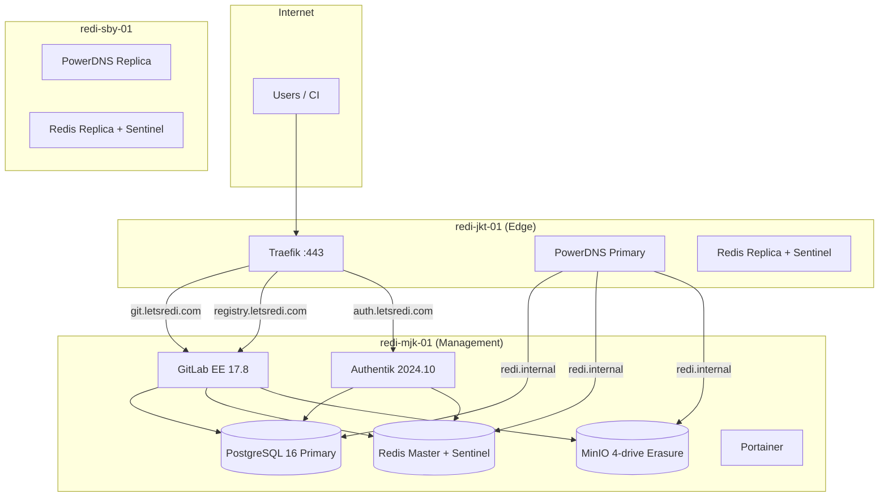

# REDI Shared Platform Foundation Report

**RAS Version:** 2.3  
**Sprint:** Sprint 2 — REDI Shared Services Foundation  
**Date:** 2026-06-29  
**Decision:** **PASS WITH WARNINGS**

---

## Executive Summary

The REDI Platform has been rebuilt on a **Shared Services Architecture**. GitLab Community Edition was destroyed (no production data). The shared platform (PostgreSQL, Redis, MinIO), GitLab Enterprise Edition (free tier), and Authentik are deployed on **redi-mjk-01** and consume shared services exclusively.

Preserved infrastructure: **PowerDNS HA**, **Traefik**, **Tailscale**, existing backup scripts (extended for shared services).

---

## Final Architecture

**Design principle:** All REDI applications connect to `postgres.redi.internal`, `redis.redi.internal`, and `minio.redi.internal`. No application deploys embedded PostgreSQL, Redis, or object storage.

---

## Cluster Topology

| Node | Hostname | Public IP | Tailscale | Role |
|------|----------|-----------|-----------|------|
| Jakarta | `redi-jkt-01` | 103.149.238.98:22 | 100.79.82.92 | Edge, Traefik, PowerDNS primary, Redis replica |
| Surabaya | `redi-sby-01` | 103.80.214.144:2280 | 100.67.138.25 | PowerDNS replica, Redis replica |
| Management | `redi-mjk-01` | 103.80.214.226:2280 | 100.81.86.37 | Shared platform, GitLab EE, Authentik, Portainer |

**Docker networks:**
- `redi-internal` (172.31.0.0/24) — shared platform + consumers
- `redi-management` (172.30.0.0/24) — management workloads
- `redi-proxy` (172.29.0.0/24) — Traefik (jkt)

---

## Shared Services

### PostgreSQL

| Property | Value |
|----------|-------|
| Image | `postgres:16-alpine` |
| Container | `redi-postgres` |
| Host | `postgres.redi.internal` → `100.81.86.37:5432` |
| Docker alias | `postgres.redi.internal` on `redi-internal` |
| Databases | `gitlabhq_production`, `authentik` |
| Replication | Configured (`repl` user, WAL level replica); **replica not yet deployed on jkt** |
| HAProxy | Bypassed — direct bind on Tailscale IP |

### Redis

| Property | Value |
|----------|-------|
| Image | `redis:7.4-alpine` |
| Master | `redi-mjk-01` — `redis.redi.internal:6379` |
| Sentinel | `redis-sentinel.redi.internal:26379` (master name `redi-master`) |
| Replicas | `redi-jkt-01` deployed; `redi-sby-01` sentinel needs stabilization |
| Auth | Password-protected (`requirepass`) |

### MinIO

| Property | Value |
|----------|-------|
| Image | `minio/minio:RELEASE.2024-12-18T13-15-44Z` |
| Mode | 4-drive erasure on **single node** (mjk) |
| Endpoint | `minio.redi.internal:9000` → `100.81.86.37:9000` |
| Console | `:9003` |
| Buckets | `gitlab-artifacts`, `gitlab-lfs`, `gitlab-uploads`, `gitlab-packages`, `gitlab-mr-diffs`, `gitlab-dep-proxy`, `gitlab-terraform`, `gitlab-ci-secure-files` |

### Internal DNS (`redi.internal`)

Registered in PowerDNS (jkt):

| Record | Target |
|--------|--------|
| `postgres.redi.internal` | 100.81.86.37 |
| `redis.redi.internal` | 100.81.86.37 |
| `minio.redi.internal` | 100.81.86.37 |

Public DNS (unchanged):

| Record | Target |
|--------|--------|
| `git.letsredi.com` | 103.149.238.98 (Traefik) |
| `registry.letsredi.com` | 103.149.238.98 |
| `auth.letsredi.com` | 103.149.238.98 |

---

## Application Dependencies

### GitLab Enterprise Edition

| Component | Configuration |
|-----------|---------------|
| Image | `gitlab/gitlab-ee:17.8.1-ee.0` (free tier, no license) |
| Container | `redi-gitlab` on mjk |
| PostgreSQL | `postgresql['enable'] = false` → `postgres.redi.internal:5432` / `gitlabhq_production` |
| Redis | `redis['enable'] = false` → `redis.redi.internal:6379` (shared master via Docker DNS) |
| Object storage | MinIO at `http://minio.redi.internal:9000` (all GitLab buckets) |
| Registry | Enabled, proxied via Traefik |
| SSH | `git.letsredi.com:2222` |
| Mesh HTTP | `100.81.86.37:8929` |

### Authentik

| Component | Configuration |
|-----------|---------------|
| Image | `ghcr.io/goauthentik/server:2024.10.4` |
| URL | `https://auth.letsredi.com` |
| PostgreSQL | `postgres.redi.internal` / database `authentik` |
| Redis | `redis.redi.internal:6379` |
| Mesh | `100.81.86.37:9100` |

### GitLab Platform Init

REDI group and 8 shell repositories initialized via `init-gitlab-platform.sh`:
`redi-foundation`, `redi-platform`, `redi-runtime`, `redi-infrastructure`, `redi-knowledge`, `redi-ai`, `redi-lab`, `redi-examples`

---

## Validation (Phase 5)

| Check | Result | Notes |
|-------|--------|-------|
| PostgreSQL endpoint `:5432` | **PASS** | `pg_isready` / `psql` via Tailscale |
| Redis endpoint | **PASS** | `PONG` with auth |
| MinIO health | **PASS** | `/minio/health/live` |
| GitLab HTTPS | **PASS** | `https://git.letsredi.com` → HTTP 200 |
| GitLab shared PostgreSQL | **PASS** | No embedded `postgresql` in `gitlab-ctl status` |
| GitLab shared Redis | **PASS** | No embedded `redis`; connects to `redis.redi.internal` |
| GitLab shared MinIO | **PASS** | Object store configured in `gitlab.rb` |
| Authentik healthy | **PASS** | `/-/health/ready/` |
| Internal DNS | **PASS** | Zone `redi.internal` on PowerDNS (jkt) |
| Traefik | **PASS** | Routes git, registry, auth |
| PostgreSQL automatic failover | **NOT TESTED** | Single primary; replica pending |
| Redis failover | **NOT TESTED** | Sentinel running; failover drill pending |
| Backup | **PASS** | `backup-all.sh` extended for PG/Redis/MinIO |

**Validation script:** `scripts/deploy/validate-shared-platform.sh`

---

## Backup Strategy

Extended `scripts/backup/backup-all.sh` on **redi-mjk-01**:

| Asset | Method |
|-------|--------|
| Shared PostgreSQL | `pg_dumpall` → `shared-postgres-all.sql.gz` |
| Shared Redis | Tar `data/shared-platform/redis/` (AOF) |
| MinIO | Bucket inventory via `mc ls -r` |
| GitLab | `gitlab-backup create` + `gitlab.rb` + secrets |
| PowerDNS / Traefik | Unchanged (jkt/sby) |

**Schedule:** Existing cron on each node (preserved).

---

## Recovery Strategy

| Scenario | Recovery |
|----------|----------|
| PostgreSQL data loss | Restore `shared-postgres-all.sql.gz`; re-run `init-shared-databases.sh` if users missing |
| Redis data loss | Restore AOF tarball; restart `redi-redis` |
| MinIO data loss | Restore drive data under `data/shared-platform/minio/data{1-4}` |
| GitLab failure | `gitlab-backup restore` + shared services must be healthy first |
| Full mjk loss | Redeploy compose from repo; restore backups; update PowerDNS `redi.internal` if IP changes |
| jkt Traefik loss | Redeploy Traefik config from `config/traefik/` |

---

## Known Risks

1. **PostgreSQL single point of failure** — Primary only on mjk; streaming replica on jkt not completed.
2. **MinIO not distributed** — Single-node 4-drive erasure, not 3-node cluster as originally scoped.
3. **GitLab Redis via Docker DNS, not Sentinel** — Sentinel hairpin/NAT issues with Tailscale IP prevented reliable Sentinel discovery from GitLab container; direct `redis.redi.internal` used. Failover requires GitLab reconfigure or Sentinel `announce-ip` work.
4. **HAProxy removed** — PostgreSQL exposed directly on Tailscale `:5432` instead of HAProxy `:5433`.
5. **sby Redis Sentinel** — Intermittent restarts; needs same env/compose sync as jkt.
6. **Credentials in runtime** — DB passwords in `/opt/redi/secrets/runtime/shared-db.env` on mjk; rotate per security policy.

---

## Recommendations

1. **Complete PostgreSQL replica** on jkt via `pg_basebackup` + `docker-compose.replica.yml`; validate promotion with `postgres-failover.sh`.
2. **Expand MinIO** to multi-node distributed mode when jkt/sby storage paths are ready.
3. **Configure Sentinel announce-ip** or deploy HAProxy for Redis/PG so all consumers use Sentinel consistently.
4. **Run Redis failover drill** — `SENTINEL failover redi-master` with application connectivity verification.
5. **Stabilize sby Redis** — redeploy with updated `docker-compose.yml` and `NODE_MESH_IP`.
6. **Enable GitLab EE license** when CTO approves (optional features).
7. **Authentik initial setup** — complete admin wizard at `https://auth.letsredi.com/if/flow/initial-setup/`.
8. **Secrets management** — migrate runtime passwords to Vault or sealed secrets.

---

## Repository Artifacts

| Path | Purpose |
|------|---------|
| `compose/shared-platform/` | PostgreSQL, Redis, MinIO, HAProxy (optional) |
| `compose/gitlab/` | GitLab EE external services |
| `compose/authentik/` | Authentik |
| `scripts/deploy/deploy-shared-platform.sh` | Phase 1 deploy |
| `scripts/deploy/deploy-gitlab.sh` | Phase 2 deploy |
| `scripts/deploy/deploy-authentik.sh` | Phase 3 deploy |
| `scripts/deploy/setup-internal-dns.sh` | Phase 4 DNS |
| `scripts/deploy/validate-shared-platform.sh` | Phase 5 validation |
| `scripts/deploy/init-shared-databases.sh` | DB/user provisioning |
| `scripts/deploy/create-minio-buckets.sh` | GitLab buckets |
| `config/traefik/dynamic/authentik.yml` | Auth route |

---

## Decision

### **PASS WITH WARNINGS**

The shared platform foundation is operational. GitLab EE and Authentik run on shared PostgreSQL, Redis, and MinIO with no embedded data stores. DNS, Traefik, and Tailscale are preserved and routing traffic.

Warnings reflect incomplete HA validation (PostgreSQL replica, Redis failover drill, MinIO distribution) and GitLab's direct Redis connection instead of Sentinel-based discovery. These are documented remediation items, not blockers for Sprint 2 foundation delivery.

---

*Generated by REDI Bootstrap Agent — RAS 2.3 Sprint 2*
