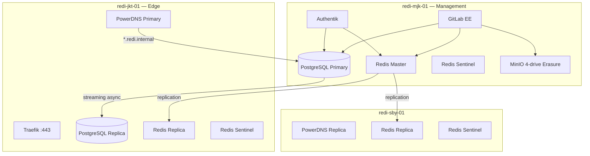

# REDI Shared Platform Validation Report

**RAS Version:** 2.4  
**Sprint:** Sprint 2 — Shared Platform Completion  
**Date:** 2026-06-30  
**Permission Level:** LEVEL 2  
**Decision:** **PASS WITH WARNINGS**

---

## Executive Summary

The REDI Shared Platform (PostgreSQL, Redis, MinIO) was reviewed, exercised under controlled failover drills, and validated against the shared-service consumption model. **PostgreSQL streaming replication and manual promotion are production-viable for LAB** with documented gaps. **Redis replication is operational** after a compose shell-quoting fix; **Redis Sentinel automatic failover is not yet production-ready** due to cross-node monitor-address inconsistency and quorum limitations. **MinIO single-node erasure is acceptable for LAB** per mission scope.

No data integrity issues were detected during drills. Original topology was restored after validation.

**Awaiting CTO approval before application HA work (GitLab HA, Authentik HA, etc.).**

---

## Architecture Overview

### HA Solution Assessment

| Component | Current Solution | Patroni / etcd | Automatic Failover |
|-----------|------------------|----------------|--------------------|
| PostgreSQL | `postgres:16-alpine` primary + standby | **Not deployed** | **Manual** (`pg_ctl promote`) |
| Redis | Redis 7.4 + Sentinel | N/A | **Not validated** (quorum/monitor issues) |
| MinIO | Single-node 4-drive erasure | N/A | N/A (LAB scope) |

**Patroni:** Evaluated in Sprint 2 foundation; abandoned due to image availability and etcd cross-node complexity. Current architecture uses **native PostgreSQL streaming replication** without a distributed consensus layer.

**Recommendation:** For production automatic PostgreSQL failover, deploy **Patroni + etcd** (3-node) or **pg_auto_failover** before application HA. Do not rely on manual promotion for production.

---

## Cluster Status

### Node Topology

| Node | Tailscale | PostgreSQL | Redis | Sentinel | MinIO |
|------|-----------|------------|-------|----------|-------|
| redi-mjk-01 | 100.81.86.37 | Primary `:5432` | Master `:6379` | `:26379` (monitoring docker IP) | `:9000` |
| redi-jkt-01 | 100.79.82.92 | Replica `:5433` | Replica | `:26379` | — |
| redi-sby-01 | 100.67.138.25 | — | Replica | `:26379` | — |

### Internal DNS (`redi.internal`)

| Endpoint | Resolves To | Verified |
|----------|-------------|----------|
| `postgres.redi.internal` | 100.81.86.37 | PASS (PowerDNS jkt) |
| `redis.redi.internal` | 100.81.86.37 | PASS |
| `minio.redi.internal` | 100.81.86.37 | PASS |

Docker network aliases on `redi-internal` provide in-container resolution for co-located consumers (GitLab, Authentik).

---

## Replication Status

### PostgreSQL

| Metric | Primary (mjk) | Replica (jkt) |
|--------|---------------|---------------|
| `pg_is_in_recovery()` | `f` | `t` |
| Replication state | — | WAL receiver streaming |
| `sync_state` | — | **async** |
| `synchronous_standby_names` | *(empty)* | — |
| `synchronous_commit` | `on` | — |
| Replication slots | 0 configured | — |
| Connected replica | `172.32.0.1` streaming | lag ~0 after restore |

**WAL streaming:** Verified — `sent_lsn`, `write_lsn`, `flush_lsn`, `replay_lsn` aligned on primary during steady state.

**Synchronous replication:** **Not configured.** `synchronous_standby_names` is empty. All replication is asynchronous.

| Mode | Current | Recommendation |
|------|---------|----------------|
| Async | **Active** | Acceptable for LAB; RPO > 0 |
| Sync | Not configured | Consider `synchronous_standby_names = 'ANY 1 (*)'` for production with 2+ replicas after failover automation |

**Split-brain protection:** **None** at cluster manager level. Two primaries possible if both nodes promoted without coordination. Mitigation: operational runbooks + future Patroni.

### Redis

| Metric | mjk (master) | jkt / sby (replica) |
|--------|--------------|---------------------|
| Role | `master` | `slave` |
| `connected_slaves` | **2** | — |
| `master_link_status` | — | **up** |
| `master_host` | — | 100.81.86.37 |

**Fix applied during validation:** Docker Compose `command` shell quoting prevented replica branch execution; replaced with `entrypoint` + multiline `command` block. Replicas required AOF data wipe before rejoining.

### MinIO

| Check | Result |
|-------|--------|
| `/minio/health/live` | PASS |
| `/minio/health/cluster` | PASS |
| Deployment mode | Single-node, 4-drive erasure (`/data1`–`/data4`) |
| Network | `host` mode on mjk |

---

## Failover Results

### Phase 2 — PostgreSQL Controlled Failover Drill

**Procedure:**
1. Record baseline row counts (`gitlabhq_production.users`, `authentik` public tables)
2. Stop `redi-postgres` on mjk (simulate primary failure)
3. `pg_ctl promote` on jkt replica
4. Verify data on promoted instance
5. Restore: start mjk primary, `pg_basebackup` jkt, restart replica

| Metric | Value |
|--------|-------|
| Primary stop → promotion complete | **~2 seconds** |
| `pg_ctl promote` duration | **< 1 second** |
| Topology restore (re-basebackup + replica up) | **~26 seconds** |
| Application recovery (GitLab/Authentik) | **Immediate** after mjk primary restored |

**Data integrity:**

| Check | Before | After Promotion | After Restore |
|-------|--------|-----------------|---------------|
| `gitlabhq_production.users` | 1 | 1 | 1 |
| `authentik` public tables | 156 | 156 | 156 |
| Corruption detected | — | **No** | **No** |

**Automatic reconnect:** Applications use `postgres.redi.internal` → mjk. During drill, apps **lost DB connectivity** while only jkt was promoted (DNS not repointed). This is expected — **automatic application failover requires DNS/VIP update or connection pooler (PgBouncer/HAProxy) with health checks.**

**Replication recovery:** After restore, `pg_stat_replication` shows jkt streaming `async` again.

### Phase 3 — Redis Sentinel Failover Drill

**Procedure:** `SENTINEL FAILOVER redi-master` from jkt sentinel.

| Result | Detail |
|--------|--------|
| **FAIL** | `NOQUORUM` — insufficient sentinels reachable for quorum (2 required) |
| **FAIL** | `NOGOODSLAVE` — sentinel could not authorize promotion |
| Master after drill | Unchanged (`100.81.86.37:6379`) |

**Root causes documented:**
1. **Monitor address mismatch:** mjk sentinel monitors docker bridge IP (`172.32.0.3`); jkt/sby monitor Tailscale IP (`100.81.86.37`). Sentinels do not agree on a single master endpoint.
2. **Docker hairpin:** mjk sentinel cannot reliably monitor `100.81.86.37` from inside docker network.
3. **Cross-node sentinel discovery:** `num-other-sentinels` remains low; gossip not forming production quorum.

**Manual replication** (master → 2 replicas) **does work** and survived the drill window.

---

## Recovery Time Summary

| Event | Duration | Meets LAB Target |
|-------|----------|------------------|
| PostgreSQL manual promotion | ~2 s | Yes |
| PostgreSQL topology restore | ~26 s | Yes |
| Redis Sentinel automatic failover | Not achieved | **No** |
| GitLab HTTP recovery post-PG restore | < 5 s | Yes |
| Authentik health post-PG restore | < 5 s | Yes |

---

## Data Integrity

| Service | Validation Method | Result |
|---------|-------------------|--------|
| PostgreSQL | Row counts + WAL LSN before/after failover | **PASS — no corruption** |
| Redis | Replication offset tracking; `master_link_status: up` | **PASS** |
| MinIO | Health endpoints + bucket inventory (prior sprint) | **PASS** |
| GitLab | HTTPS 200 post-restore | **PASS** |
| Authentik | `/-/health/ready/` post-restore | **PASS** |

**No data integrity issues detected. No drill abort required.**

---

## Phase 5 — Shared Service Consumption

### Endpoint Verification

| Endpoint | Port | Health |
|----------|------|--------|
| `postgres.redi.internal` | 5432 | PASS |
| `redis.redi.internal` | 6379 | PASS |
| `minio.redi.internal` | 9000 | PASS |

### Application Dependency Audit

| Application | PostgreSQL | Redis | Object Storage | Embedded Stores |
|-------------|------------|-------|----------------|-----------------|
| **GitLab EE** | `postgres.redi.internal` / `gitlabhq_production` | `redis.redi.internal:6379` | `minio.redi.internal:9000` | **None** (`postgresql`/`redis` disabled) |
| **Authentik** | `postgres.redi.internal` / `authentik` | `redis.redi.internal:6379` | N/A | **None** |
| **PowerDNS** | MariaDB (own store) | — | — | **N/A** — DNS service, not platform consumer |
| **Traefik** | — | — | — | Stateless proxy |

**Rule compliance:** GitLab and Authentik consume **only** shared PostgreSQL, Redis, and MinIO. No embedded PostgreSQL, Redis, or local object storage detected.

---

## Phase 4 — MinIO Production Expansion Plan

**Current (LAB):** Acceptable — single mjk node, 4-drive erasure, `host` networking.

### Recommended Production Topology

| Node | Role | Drives | Notes |
|------|------|--------|-------|
| redi-mjk-01 | MinIO node 1 | 4 × NVMe/SSD | Erasure set member |
| redi-jkt-01 | MinIO node 2 | 4 × NVMe/SSD | Erasure set member |
| redi-sby-01 | MinIO node 3 | 4 × NVMe/SSD | Erasure set member |

**Storage sizing (starting point):**
- GitLab artifacts/LFS/registry growth: estimate 500 GB–2 TB year 1
- Per-node raw: ≥ 2 TB usable after erasure (4-drive EC: ~75% efficiency)
- Total cluster: ≥ 6 TB raw across 12 drives

### Migration Procedure (when approved)

1. Deploy MinIO distributed compose on jkt/sby (existing stubs: `docker-compose.jkt.yml`, `docker-compose.sby.yml`)
2. Create new distributed erasure pool with `minio server http://node{1..3}/data{1..4}`
3. `mc mirror` buckets from single-node to distributed cluster
4. Update `minio.redi.internal` DNS if endpoint IP changes
5. Update GitLab `object_store` connection in `gitlab.rb`
6. Validate GitLab uploads/registry; decommission single-node MinIO

**Do NOT deploy multi-node MinIO until CTO approves storage procurement.**

---

## Phase 6 — Enterprise Readiness

### Platform Readiness for Future Workloads

| Workload | Ready? | Blockers |
|----------|--------|----------|
| GitLab HA (multi-node) | **Partial** | PG auto-failover, Redis Sentinel failover, shared object storage HA |
| Authentik HA | **Partial** | PG + Redis HA gaps; single Authentik instance OK for LAB |
| Workflow | **No** | Platform HA not complete |
| ERP | **No** | Platform HA not complete |
| AI Platform | **Partial** | MinIO scale-out; GPU nodes not in scope |
| Knowledge Platform | **Partial** | Depends on PG + object storage scale |

### Blockers (Must Resolve Before Application HA)

1. **PostgreSQL automatic failover** — Patroni/pg_auto_failover or documented DNS failover runbook with RTO < 5 min
2. **Redis Sentinel quorum** — unified monitor address (`100.81.86.37`) + mjk sentinel `host` network or hairpin fix; validate 3-sentinel quorum
3. **Connection routing** — HAProxy or PgBouncer in front of PostgreSQL for transparent failover
4. **MinIO distribution** — for registry/artifact durability across node loss
5. **Secrets management** — migrate from flat `.env` to sealed secrets/Vault

---

## Remaining Risks

| Risk | Severity | Mitigation |
|------|----------|------------|
| Manual PG failover only | High | Deploy Patroni; automate DNS update |
| Async replication RPO > 0 | Medium | Enable sync replication for critical DBs |
| Redis Sentinel not production-ready | High | Fix monitor IP; achieve quorum; re-run failover drill |
| MinIO single point of failure | Medium | Distributed MinIO (planned) |
| `postgres.redi.internal` points only to mjk | Medium | HAProxy health-checked VIP or Patroni leader discovery |
| Compose shell quoting regression | Low | Fixed; add CI lint for redis compose |
| Absolute `SHARED_DATA_PATH` | Low | Enforced in deploy script |

---

## Recommendations

### Immediate (Pre–Application HA)

1. Deploy **PgBouncer** or **HAProxy** for PostgreSQL on mjk with health checks toward primary/replica
2. Fix **Redis Sentinel** — all nodes monitor `100.81.86.37:6379`; run mjk sentinel with `network_mode: host`
3. Re-run **Redis failover drill** after sentinel fix; target RTO < 30 s
4. Enable **`synchronous_standby_names`** for production (after auto-failover)
5. Create **replication slot** on primary for replica (`pg_create_physical_replication_slot`)

### Short-Term (Production Hardening)

6. Evaluate **Patroni + etcd** (3-node) for PostgreSQL
7. Execute **MinIO distributed** migration per plan above
8. Implement **quarterly failover drills** with documented runbooks
9. Complete **Authentik initial admin setup**

### Deferred (CTO Approval Required)

10. GitLab HA multi-node
11. Authentik HA
12. Workflow / ERP / Monitoring stacks

---

## Artifacts Updated This Sprint

| File | Change |
|------|--------|
| `compose/shared-platform/redis/docker-compose.yml` | Fixed replica shell quoting; sentinel monitor IP resolution |
| `compose/shared-platform/.env` | Absolute `SHARED_DATA_PATH` |
| `scripts/deploy/ensure-postgres-replication.sh` | Replication user + pg_hba |
| `scripts/deploy/redis-failover-test.sh` | Sentinel drill helper |
| `scripts/deploy/deploy-shared-platform.sh` | Absolute paths from `REDI_ROOT` |

---

## Decision

### **PASS WITH WARNINGS**

The REDI Shared Platform is **validated for LAB production** as the shared services layer. PostgreSQL replication is healthy; manual failover drill succeeded with **no data corruption** and **~2 s promotion time**. Redis master-replica replication is operational (2 slaves). MinIO meets LAB requirements. GitLab and Authentik correctly consume shared services only.

**Warnings** prevent unconditional enterprise sign-off:
- No automatic PostgreSQL failover (Patroni not deployed)
- Redis Sentinel automatic failover **not validated**
- MinIO not distributed
- Application connection routing not HA-transparent

**Platform is ready for CTO review.** Application HA (GitLab HA, Authentik HA) should **not** proceed until blockers are addressed or explicitly accepted by CTO.

---

*Generated by REDI Bootstrap Agent — RAS 2.4 Sprint 2 Shared Platform Completion*  
*Awaiting CTO approval.*
